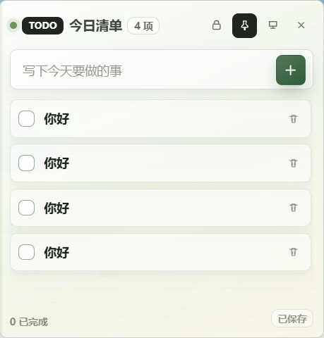

# Codex Desktop TODO

一个极简的 Windows 桌面 TODO 便签应用。它像小便签一样贴在桌面上，适合放几件今天一定要记住的小事。



## 下载

Windows 便携版可以在 GitHub Release 中下载：

[下载 DesktopTODO-0.1.0.exe](https://github.com/XavierJiezou/Codex-Desktop-TODO/releases/tag/v0.1.0)

## 功能

- 无边框桌面小窗，可拖动、调整大小。
- 默认置顶，可一键取消置顶。
- 可锁定位置，避免误拖动。
- 支持添加、完成、删除、双击编辑 TODO。
- 支持隐藏到系统托盘。
- 自动保存任务、窗口位置、大小和偏好设置。
- 数据只保存在本机，不需要登录。

## 开发

```bash
npm install
npm run start
```

## 打包

```bash
npm run build
```

打包后的 Windows portable 程序会生成在 `dist/` 目录中。

## 技术栈

- Electron
- 原生 HTML / CSS / JavaScript
- Vitest
- electron-builder

## 测试

```bash
npm test
```

## License

MIT
